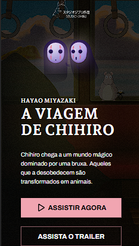

# Projeto Completo Studio Ghibli

Este projeto é inspirado nos designs do Studio Ghibli, desenvolvido a partir do desafio 5 do Codelância, com o design original criado por Iuri Code do CodeLab.

## 🎨 Descrição

O "Projeto Completo Studio Ghibli" é uma aplicação web que visa reforçar conceitos fundamentais de desenvolvimento frontend, utilizando as tecnologias HTML5, CSS3 e JavaScript. Este projeto foi desenvolvido com base em um design do Figma, seguindo um fluxo de trabalho comum em projetos de frontend, onde as demandas são estabelecidas em ferramentas como Figma, Trello, entre outras.

## 🛠️ Tecnologias Utilizadas

- **HTML5**: Estruturação do conteúdo.
- **CSS3**: Estilização e layout responsivo.
- **JavaScript**: Interatividade e manipulação do DOM.

## 🚀 Objetivo

O principal objetivo deste projeto é aprimorar habilidades de desenvolvimento frontend, explorando a implementação de um design estático em uma página web funcional e interativa.

## 📑 Como Usar

1. Clone o repositório:
   ```bash
   git clone https://github.com/ediellyf/projeto-completo-studio-ghibli.git



